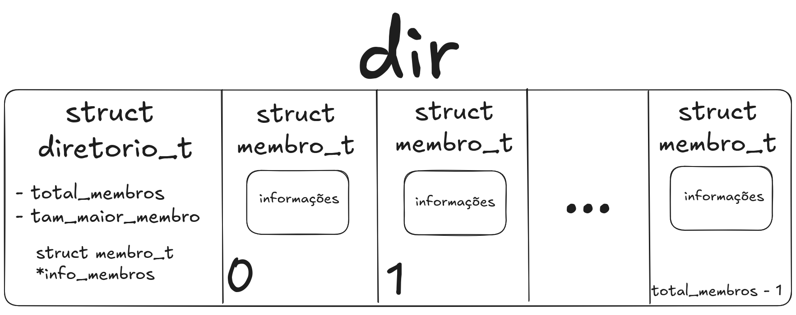
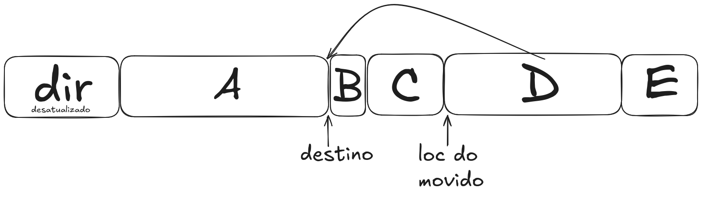
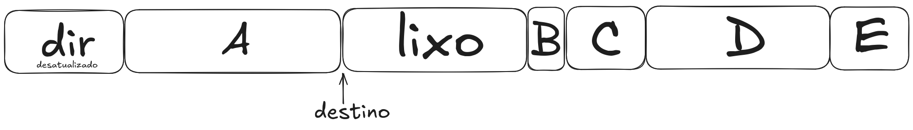
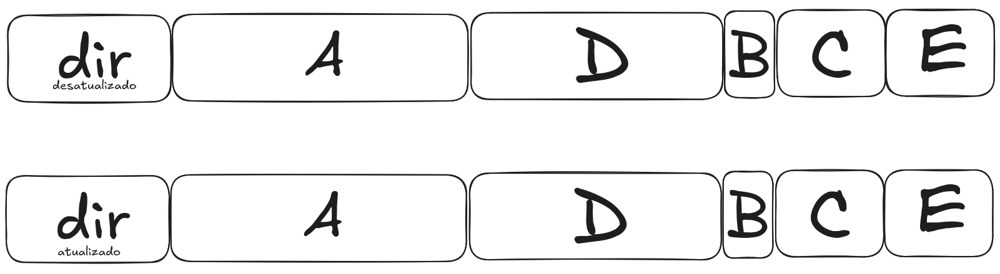
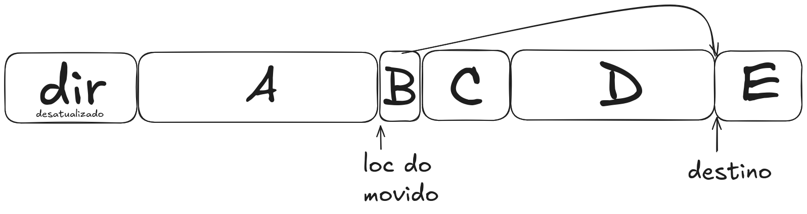
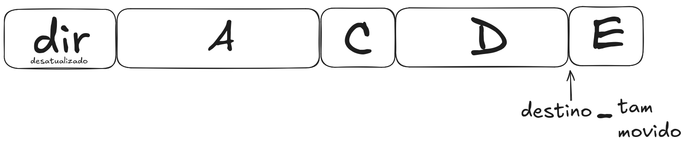
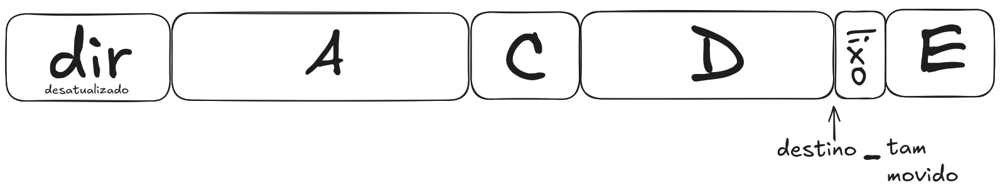
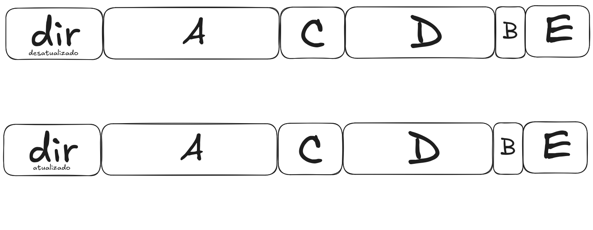

# Trabalho de Programação 2: Archiver VINAC

**Autor:** Vinícius Gregorio Fucci  
**GRR20241272**

Este projeto implementa o VINAC, um arquivador desenvolvido para a disciplina de Programação 2.
O arquivador suporta operações no seguinte formato:
./vinac <opção> <archive> [membro1 membro2 ...]
archive é o arquivo compactado que vai ser manipulado ou criado, e precisa ter extensão ".vc". Em meu código e relatório, eu me refiro a esse arquivo como "arquivo vina".

## Sessão: Operações suportadas

-ip (ou -p) : insere/acrescenta um ou mais membros sem compressão ao
archive. Caso o membro já exista no archive, ele deve ser substituído.
Novos membros são inseridos respeitando a ordem da linha de comando, ao
final do archive;

-ic (ou -i) : insere/acrescenta um ou mais membros com compressão ao
archive. Caso o membro já exista no archive, ele deve ser substituído.
Novos membros são inseridos respeitando a ordem da linha de comando, ao
final do archive;

-m membro target : move o membro indicado na linha de comando para imediatamente
depois do membro target existente em archive. A movimentação deve ocorrer
na seção de dados do archive; para mover para o início, o target deve ser
NULL (ou seja, só fazer -m membro);

-x : extrai os membros indicados de archive. Se os membros não forem
indicados, todos devem ser extraídos. A extração consiste em ler o membro
de archive e criar um arquivo correspondente, com conteúdo idêntico, em
disco;

-r : remove os membros indicados de archive;

-c : lista o conteúdo de archive em ordem, incluindo as propriedades de
cada membro (nome, UID, tamanho original, tamanho em disco e data de
modificação) e sua ordem no arquivo.

## Sessão: Arquivos e diretórios da entrega

- `vina.c` Função principal do programa
- `arquivo.c` Implementação das operações do programa
- `arquivo.h`
- `auxiliares.c` Implementação de funções auxiliares às operações do programa
- `auxiliares.h`
- `lz.c` Biblioteca de Compressão 
- `lz.h`
- `MAKEFILE` Script para gerar executável do programa
- `README.md`
- `/imagens_README` Diretório com imagens utilizadas nesse README

## Sessão: Estruturas de dados utilizada

Foi implementado uma área de diretório no começo do arquivo compactado. Essa área armazena uma `struct diretorio_t`, um sentinela para saber o tamanho do vetor de membros (`total_membros`) e que prevê um ponteiro para uma posição de `struct membro_t`, para ser possível a manipulação das informações de cada membro.

Imagens ilustrativa dessa divisão no arquivo vina:  

**Funções auxiliares para o diretório:**

**Criação diretório:** se não existir um arquivo compactado e a operação do usuário for de inserir, será alocado em memória RAM um diretório, assim como o seu vetor de informações dos membros, para ser manipulado e escrito em um arquivo binário as informações de forma coerente.

**Carregando um diretório:** se um arquivo vina já existe, então será necessário extrair as informações que temos sobre esse arquivo. O binário do arquivo vina será lido e corretamente interpretado para uma alocação em memória RAM e ser possível manipulá-lo.

Após o fim da área do diretório, existe apenas os membros (arquivos binários da entrada do usuário), como ilustra a imagem:  

## Sessão: Algoritmos utilizados para as operações

Todas as operações principais carregam uma `struct diretório` e o vetor de `info_membros` já existente, exceto as de inserir que podem criá-los ou carregá-los.

---

### `mover(nome_arquivo_vina, nome_membro, nome_target)`

Encontra o id do membro e do target usando os nomes. Se target `NULL` então desloca para o começo.  
Não faz nada se tentar mover imediatamente para trás ou para frente de si mesmo.

Para mover de fato os membros do arquivo vina, vamos separar em duas etapas:  
**etapa 1** → mover o conteúdo dos membros (o binário)  
**etapa 2** → atualizar o diretório (agora os membros estão em outras posições então a informação antiga está incorreta).

**A etapa 1** usa de funções auxiliares para deslocar os bytes dos arquivos.

**Deslocar esquerda:** começa no início do arquivo. Ela respeita o parâmetro passado `offset`, ou seja, se for para deslocar para esquerda um byte que sobrescreveria uma parte do binário que está antes do início, a função não sobrescreve essa parte e descarta esses bytes. Ao final é feito um `truncate` para reduzir o tamanho do arquivo em "deslocamento".

**Deslocar direita:** começa pelo fim do arquivo e vai deslocando para a direita até chegar no parâmetro passado `offset`. É feito um `truncate` para aumentar o tamanho do arquivo em "deslocamento".

### Além dessas 2 etapas, o move pode ser divido em dois casos:

**Caso 1: mover para trás (`id_target < id_membro`)**  
Ilustração: **D para depois de A** (`id_membro = 3`,`id_target = 0`):
  

Deslocar `tam_membro` à direita o arquivo a partir de `inicio` para criar um espaço vazio.  
  

Sobrescrever o espaço vazio criado com o membro que quer ser movido.  

  
Deslocar `tam_membro` à esquerda para apagar o membro movido que está repetido e atualizar o diretório para o Caso1 (Etapa 2).  

**Caso 2: mover para frente (`id_target > id_membro`)**  
Ilustração: **B para depois de D** (`id_membro = 1`,`id_target = 3`):
  

Deslocar `tam_membro` à esquerda para apagar o membro movido que está repetido, ou seja, apagar o membro em sua posição desatualizada. Tudo bem isso porque o membro está alocado em um buffer então não vamos perder a informação.  
  

Deslocar `tam_membro` à direita a partir da posição em que ele será escrito.  
  

Sobrescrever o membro movido em sua devida posição e atualizar o diretório para o Caso2 (Etapa 2).  

**Observação**: atualizar o diretório é feito através de uma função auxiliar (diferente para cada um dos casos) em que é alocado um novo struct diretorio_t com um vetor de info_membros e é preenchido com as informações do antigo diretório de acordo com cada caso, e por fim é devolvido esse novo diretorio o qual substitui o antigo.

---

### `inserir (ip)`

Cria ou carrega o diretório, verifica se um membro com esse nome já existe.  
- Se já existir, ele remove esse membro antigo, insere ao final do arquivo o novo, e chama a função `move` para mover o membro para sua posição original.  
- Se não existir ainda, ele segue com a inserção no final.  
  - Ele realoca o vetor de informações de membros, coloca no vetor as informações do novo membro e atualiza os valores das localizações dos membros porque inserir um novo membro aumenta em `sizeof(struct membro_t)`.  
  - **Caso 1:** primeiro membro sendo inserido no arquivo → ele escreve diretamente a área do diretório.  
  - **Caso 2:** não é o primeiro membro sendo inserido → a área do diretório aumentou em `sizeof(struct membro_t)`, por isso, a partir do começo do primeiro membro, é deslocado essa posição para a direita. Cria um espaço com valor lixo que é sobrescrito com o diretório.
  Por fim, ele escreve o arquivo inserido ao final do arquivo vina.

---

### `inserir (ic)`

O algoritmo é feito de maneira análoga ao inserir (ip). A diferença é que, se for inserir um novo membro, antes é feito a compressão do membro e, se o tamanho comprimido for menor que o tamanho original, é escrito o membro comprimido. Senão, é chamado a função de inserir sem compressão.

---

### `Remover`

Para remover o arquivo, precisamos remover o binário dele e a `struct membro_t` que guarda as informações dele.  
- A função carrega o diretório, chama a função para mover o membro a ser removido para o final, carrega o diretório de novo.  
- Com isso, o binário do membro está no final do arquivo e a `struct membro_t` com a informação do membro está no final da área do diretório.  
- Então é feito dois deslocar para a esquerda: primeiro para apagar a última `struct membro_t` e depois para apagar o último membro.  
- Após isso, é necessário atualizar o diretório porque, como apagou a última `struct membro_t`, todas as localizações dos membros foram deslocadas `sizeof(struct membro_t)` para à esquerda, além de ter reduzido o total de membros. Após atualizar o diretório ele é sobrescrito.
- Por fim, é feito um truncamento do arquivo com o novo tamanho dele.
- Se o arquivo vina tinha 1 membro e esse membro for removido, o arquivo vina é apagado.

---

### `extrair`

Carrega o diretório, acha a posição do membro a ser extraído, carrega em um buffer o binário desse membro e escreve um arquivo com o nome desse membro.  
Caso o membro tenha sido compactado (tamanho do disco ser menor que o original), ele é extraído descompactado.

---

### `listar`

Carrega o diretório e imprime as suas informações: nome, UID, tamanho original, tamanho em disco e data de modificação e sua ordem no arquivo.

---

## Sessão: Funções auxiliares

- **termina_com_vc**: recebe uma string e retorna se ela termina com a extensão ".vc".

- **deslocar_esq**: começa no início do arquivo. Ela respeita o parâmetro passado `offset`, ou seja, se for para deslocar para esquerda um byte que sobrescreveria uma parte do binário que está antes do início, a função não sobrescreve essa parte e descarta esses bytes. Ao final é feito um `truncate` para reduzir o tamanho do arquivo em "deslocamento".

- **deslocar_dir**: começa pelo fim do arquivo e vai deslocando para a direita até chegar no parâmetro passado `offset`. É feito um `truncate` para aumentar o tamanho do arquivo em "deslocamento".

- **carregar_diretorio**: abre o arquivo vina em binário e

- **criar_diretorio**: aloca uma struct `diretorio_t`.

- **novo_info_desl_esq**: devolve um novo vetor de struct `membro_t` com as informações atualizadas. `id_target` e `id_membro` se referem aos ids do diretório não atualizado. No vetor atualizado, de 0 até o `id_target` é igual ao antigo, o `id_target + 1` é igual ao membro do `id_membro`, depois desse até o `id_membro` é igual ao antigo deslocado 1 para a direita, e o resto a partir daí é igual.

- **novo_info_desl_dir**: devolve um novo vetor de struct `membro_t` com as informações atualizadas. `id_target` e `id_membro` se referem aos ids do diretório não atualizado. No vetor atualizado, de 0 até antes do `id_membro` é igual, do `id_membro` até antes do `target` é deslocado 1 para a direita, o `id_target` é igual ao membro do `id_membro`, e o resto a partir daí é igual.

- **inserir_repetido**: é o caso em que é detectado que o termo a ser inserido é repetido. Ele remove o membro repetido, adiciona ele no mesmo modo de inserção e move para a posição antiga.

- **atualizar_diretorio**:

## Sessão: Tratamento de erros

Foram feitas diversas verificações para captar erros nas operações. As únicas funções que não foram verificadas quanto ao funcionamento foram as de `fseek`, `fwrite` e `fread`. As funções que são operações do programa retornam erros. Se for um erro que não pode acontecer porque a `main` evita um caso desses (como tentar fazer uma operação diferente de inserção em um arquivo vina que não existe), retorna um número negativo. Os demais erros relacionados a `alloc`, erro ao abrir arquivo, parâmetros inválidos, retornam números inteiros positivos. Erros em funções auxiliares como `desloc_esq` emitem um erro pela saída de erro e retornam.

## Sessão: alternativas de implementação

- **Escolha de estrutura de dados do diretório**: dinâmica e um vetor sendo realocado porque um tamanho sem desperdício é essencial para um archiver.

- **Tratamento dos arquivos binários**: são deslocados por um buffer que tem um tamanho igual ao do maior membro do arquivo, ou seja, é feita uma manipulação em disco do binário.

- **Tratamento dos arquivos binários**:

## Sessão: Soluções de dificuldades encontradas

- **Problemática 1**: lixo de memória ao deslocar e ao copiar o nome de um membro. Esse problema não afetava o funcionamento do programa, porque as informações essenciais ainda estavam na posição certa e sendo acessadas de maneira certa. Mas ao abrir o hexadecimal era possível ver informações perdidas de versões anteriores do arquivo vina. Problemas desse tipo podem causar falhas de segurança por gravarem conteúdos de lixo de memória (vai que as informações do seu cartão de crédito estão na memória RAM e são gravadas no programa). Por isso, em trechos de transcrever nome dos arquivos (a string nome tem tamanho imenso e o `strcpy` só escreve até um certo ponto, deixando o depois do `\0` com valores lixo), e transcrever a struct `membro_t` no `realloc`, foi usado `memset` para zerar as informações antes de atribuir os valores, arrumando essa problemática.

- **Problemática 2**: buffer overflow. Na função de inserir arquivo comprimido, em arquivos pequenos como um `.txt` sem padrão contendo uma string `"abcdef"`, o arquivo comprimido pode ter um tamanho até maior do que o original. Por isso é necessário alocar um buffer maior que o tamanho original para esses casos. Arbitrariamente, é alocado um buffer 30% maior + 64 bytes (para caso o tamanho seja pequeno e multiplicar por 1,3 não adiante). Além disso, em um teste com um arquivo extremamente grande (um vídeo), o `buffer_entrada` acessou uma memória além de sua identação pela função `LZ_compress`, e alocar +3 bytes (uma margem de erro de bytes no `malloc`) resolveu esse problema, já que `buffer_entrada` vai escrever uma quantidade `tamanho_entrada`.

## Sessão: bugs conhecidos

O único bug conhecido é no **deslocar direita**. Esse bug não afeta o funcionamento do programa porque é impossível entrar no caso que será explicado aqui, mas se essa função for usada por outro programa pode ter esse comportamento. O bug é: deslocar à direita empresta do conteúdo de antes do `offset` para deslocar para a direita. Ou seja, se o tamanho total do arquivo for menor que o deslocamento, a função vai acessar uma posição de índice negativo do arquivo que dá *segmentation fault*. Mas como na `main`, usamos o deslocar direita para deslocamentos como `sizeof(struct membro_t)` ou o tamanho de um arquivo, que são menores que o arquivo vina porque estão contidos nele, não tem como acontecer isso, e se acontecesse seria impressa uma mensagem de erro. Por isso essa função não trata esse caso.
